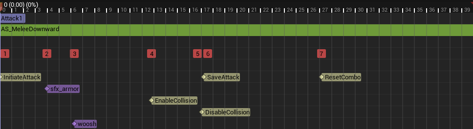
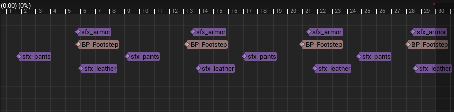
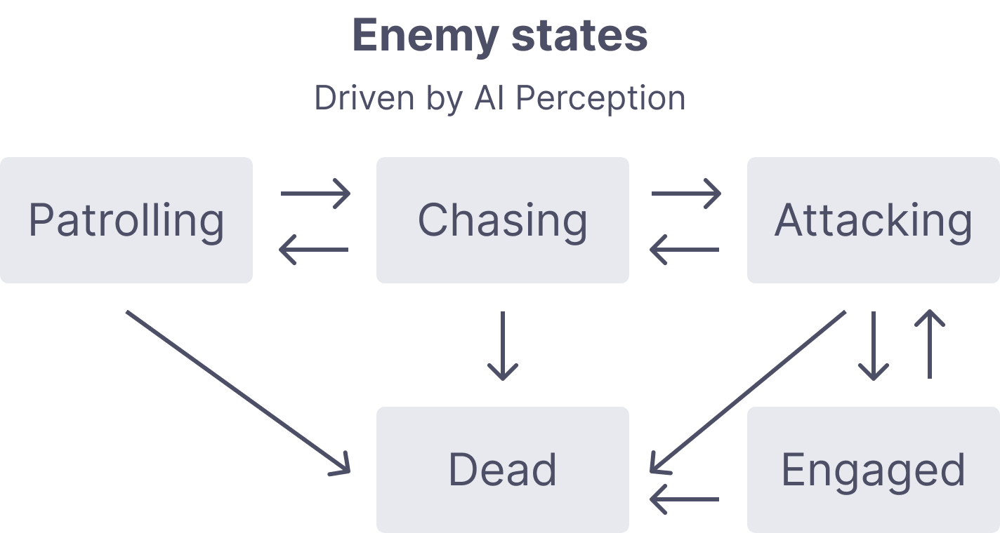

+++
date = '2025-09-02'
draft = false
title = 'Slash - An Unreal Engine 5 experiment'
+++

Wanting to learn Unreal Engine 5, I set out to follow [this course](https://www.udemy.com/course/unreal-engine-5-the-ultimate-game-developer-course/) from Stephen Ulibarri which covers a lot of topics. I ended up falling into many rabbit holes, adding many little details that were not covered by the lectures.

<!--more-->

## Main menu

### Loading a level
One of the first things I wanted to add was a nice looking main menu to which we can navigate to and from various states of the game. My first naive approach was to simply call [openLevel](https://dev.epicgames.com/documentation/en-us/unreal-engine/API/Runtime/Engine/Kismet/UGameplayStatics/OpenLevel) from my blueprints. However, it has the unpleasant side effect of creating stutters in the game. The way `openLevel` function works explains why that happens in the first place. First, it synchronously unloads the entire level you're in; then, it will load the new one and only once all of that is completed will the game resume, resulting in a suboptimal experience.

### Stream levels
Little did I know that Unreal has a nice way to [load stream levels](https://dev.epicgames.com/documentation/en-us/unreal-engine/level-streaming-overview-in-unreal-engine?application_version=5.4/), a better way to load partial (or even entire) levels. In order to make that happen, we must first create a **persistent** level that contains all of the sub-levels we want to load/unload asynchronously. The advantage of that approach is that we free up a lot of memory dynamically as we progress between the different areas of our game. AAA titles often implement what is commonly called a **loading corridor**. They serve the purpose of a buffer zone where an async memory management routine is triggered. That usually involves loading the next area and freeing up resources from the past section. On my end, the way I manage such transitions is a 3-way process that involves a loading screen:

1. Present a loading `BlueprintWidget` and keep a local reference to it.
2. Unload the current stream level and start loading the new stream level.
3. Remove the loading screen and immediately present the newly loaded level.



This blueprint is added to the `GameMode` and handles the 3-way loading processed.
{.image-caption}

### See it in action

This short video presents the main menu level and how it transitions to the game with a loading screen without interuptions in the audio channel.



## Character interactions

The main characters can interact with the environment in several ways; I'm going to present a few of them which I found interesting.

### Text dispensers

To convey messages the the player, I've added text dispenser actors, which can be configured by simply setting their `text` value. When the character overlaps with the sphere component of these dispensers, they will start typing the `text`, one letter at a time, producing a randomized typing machine sound for each letter. Upon leaving the sphere's radius, the message will animate the scale and alpha value to zero before removing it from the game. We can set the dispenser so it only displays the message a fixed number of times (once would have a value of `1`).

### Weapons

The weapons and combat system have a lot going on, but most of it was covered by Stephen's class. I'll focus on the extra features I've added that went beyond the scope of the lectures.

#### Attack chains

Instead of randomly selecting an attack, weapons have associated chains of attacks tied to them. An implementation of the interface, `IComboGenerator`, has to be created. Currently, weapons and enemies are the two actors that implement it; enemies can have several invisible weapons tied to their hands and various other hitboxes added dynamically.

```cpp
class SLASH_API IComboGenerator {
	GENERATED_BODY()

public:
	virtual TArray<UAnimMontage*> getCombos() = 0;
	virtual TArray<float> getDamageMultipliers() = 0;
	virtual float getBaseDamage() = 0;
	virtual void setMultiplierIndex(float index) = 0;
};
```

The `UComboTracker` is responsible to keep track of the attacks generated by an assigned combo generator. This allows to set specific moments after which the combo resets or even setup complex branching chains of attacks based on both input and time. In the animations, we send different notifies to drive the combo further into the chain. A blueprint can call the `BlueprintCallable` functions when it receives those notifies and manage the chain of attacks.

Specifically, `InitiateAttack` is linked to a `initiate()` call. This sets the `canProceed` variable to false until we receive another notify. `SaveAttack` marks the window from which we can proceed to the next attack in the chain and is linked to a `track()` call. If another attack is not initiated during that window of opportunity, the `ResetCombo` notify is reached and will trigger `reset()` reset the current combo index. At any point in time, the consumers of that component only need to call `getMontage()` to get the animation tied to the current combo attack.



The different notifies are time sensitive. Notably `ResetCombo` won't be reached if we trigger an attack after `SaveAttack`, progressing further in the chain of attacks.
{.image-caption}

```cpp
class SLASH_API UComboTracker : public UActorComponent {
	GENERATED_BODY()

public:
	UComboTracker();
	
	UFUNCTION(BlueprintCallable)
	virtual void initiate();
	
	UFUNCTION(BlueprintCallable)
	virtual void track();
	
	UFUNCTION(BlueprintCallable)
	virtual void reset();

	void assign(IComboGenerator* generator);
	UAnimMontage* getMontage();
	uint8 getIndex();
	
	UPROPERTY(VisibleInstanceOnly, BlueprintReadWrite, Category = Combo)
	bool canProceed = true;

protected:
	IComboGenerator* comboGenerator;
	uint8 comboIndex = 0;
};
```

#### Focus points

The character has two movement modes he can switch between:

1. The **standard** mode where he walks in a forward facing manner, usually used to navigate in the world.
2. The **focus** mode, where the camera tracks a focus point on the enemies and the movements are slower and oriented toward the focus.

In order to create focusable targets, I have added a socket on their heads and assigned a widget blueprint with a **dot** marker. This blueprint is presented in world space since it needs to move with the enemy's movements. The current version is very barebones in that we don't track focus priorities. We have a sphere on the character that add overlapping enemies to a list; when the player triggers the focus action, we take the last valid enemy, display it's focus marker and enter in the focus mode.

```cpp
void AMainCharacter::focus(const FInputActionValue& Value) {
	if (isFocused()) {
		focus(nullptr);
	} else if (!focusableEnemies.IsEmpty()) {
		AEnemy* enemy = focusableEnemies.Last();
		enemy->OnFocus();
		focus(enemy);
	}
}
```

The focus mode changes the way movement works for the character; we move more slowly in all directions while alway facing the focused target. To get the `right` motion vector, we use the vector between the character and it's target, then apply a cross product with the up vector. It results in the character following a circular motion around the focus target instead of wandering off in a straight line. To play the correct movement animation, the blueprint can use the `directionalSpeed` to blend between animations using a blend space. Finally, selecting the appropriate dodge animation to play requires the use of an `inputDirection`.

```cpp
void AMainCharacter::move(const FInputActionValue& Value) {
	if (actionState != EActionState::EAS_unoccupied) return;
	
	const FVector2D val = Value.Get<FVector2D>();
    directionalSpeed = val;
	if (isFocused()) {
		if (val.X != 0.f) {
			inputDirection = val.X > 0
				? EInputDirection::EID_right
				: EInputDirection::EID_left;
			FVector right = -focusVector.Cross(FVector::UnitZ());
			AddMovementInput(right, val.X);
		}
		
		if (val.Y != 0.f) {
			inputDirection = val.Y > 0
				? EInputDirection::EID_forward
				: EInputDirection::EID_backward;
			AddMovementInput(focusVector, val.Y);
		}
		
	} else {
		const FRotator rotation = GetControlRotation();
		const FRotator yaw = FRotator(0.f, rotation.Yaw, 0.f);
        const FRotationMatrix M = FRotationMatrix(yaw);
		inputDirection = EInputDirection::EID_forward;
		AddMovementInput(M.GetUnitAxis((EAxis::X)), val.Y);

		AddMovementInput(M.GetUnitAxis((EAxis::Y)), val.X);
	}
}
```

### Destructibles

Some actors can be destroyed because they've been converted to mesh collection. These meshes are fragmented in several parts which are held together by a "force". Granted that we apply enough counter force on the mesh, it will fall apart and the pieces will be thrown in various directions. One of the ways we do this in Unreal Engine is by applying a strain at a point of impact, then we give them a linear motion with a physics field.



This blueprint illustrates the creation of a physics force that breaks destructible meshes.
{.image-caption}

### See it in action

This short video presents the different character features that were introduced in this section.



## Dynamic footsteps

One of the instances where I went down a rabbit hole was by adding dynamic footsteps that would produce different sounds based on the surface the feet interact with. My approach is quite simple: assign physical materials to my textures and objects, give the materials their associated sound and play them instead of a fixed sound baked in the animation.

We start by creating a data asset containing the mappings of physical material and their associated sounds. We can decide to use raw wave assets, audio cues or metasounds. I have opted for metasounds because they allow better customization. Each `sfx` instance has a metasound blueprints which includes some randomization logic. We setup the values for the different footstep audios and shuffle them before playing the chosen sound with a random volume and pitch variation.



This blueprint illustrates the randomization process that creates a sound that feels less repetitive.
{.image-caption}

Once we have finished with the mappings, we need a way to trigger custom notifies in our animations whenever a foot touches the ground. The naive approach is simply play the audio here, but it doesn't allow to change the sound based on the surfaces. In my case, the `PlaySound` notify is changed for a custom blueprint class called `BP_Footstep`.



Whenever a foot hits the ground in the animation, the custom `BP_Footstep` notify is triggered.
{.image-caption}

In that blueprint, two things happen:

1. A linetrace from a point slightly above the character's location. When it succeeds, we get a hit result that will have an associated physical material (make sure to setup the `default` mapping as a fallback).
2. Find the physical material in our data asset and play the sound associated with it.



This blueprint illustrates the linetrace and selection of an appropriate audio.
{.image-caption}

### See it in action
This short video presents the different footstep sounds implemented in my game.



## Enemy AI

The enemy AI was not built using decisions tree, but by keeping track of the different states in c++. I became very quickly apparent how my approach would become problematic as I started adding more behavior variations to my enemies. On top of that, Stephen's class proposes to build these features within a reusable `Enemy` class which leads to a very large amount of code in the same pace. I have opted to create a custom `aiController` class that can be assigned to my enemies. If I want to create a completely different type of behavior, I simply need to implement a new `aiController`.

To react to the player's presence, I use the [AIPerceptionComponent](https://dev.epicgames.com/documentation/en-us/unreal-engine/ai-perception-in-unreal-engine) with a configured sight sense. This allows my enemies to react to the player's presence whenever it enters their field of sight. Whenever that happens, and depending on the distance between an enemy and the player, different states will be reached and change the way it behaves.



The enemy begins in a patrolling state. From there, the distance with the player will make it switch between the various other states that define how it will behave.
{.image-caption}

Most important perhaps is the tick function which runs patrol or combat updates depending on the current state. For instance, if the player dies, the enemy will stop chasing after it and be brought back to the patrolling state.

```cpp
void AEnemyAiController::Tick(float DeltaTime) {
	Super::Tick(DeltaTime);

	if (isDead()) return;
	if (aiProperties->combatTarget && aiProperties->combatTarget->ActorHasTag(ABaseCharacter::DEAD_CHARACTER_TAG)) {
		aiProperties->combatTarget = nullptr;
	}
	if (isEngaged() && withinCombatRadius()) {
		faceTarget(aiProperties->combatTarget, DeltaTime, 3.5f);
	} else if (isPatrolling()) {
		updatePatrolTarget();
	} else {
		updateCombatTarget();
	}
}
```

The setup for perceiving the player and move between states is as simple as implementing one function. Whenever our configured sight stimulus is active, we start chasing the seen player. 

```cpp
void AEnemyAiController::onPerceptionUpdated(AActor* Actor, FAIStimulus Stimulus) {
	if (isDead() || isChasing() || isEngaged()) return;
	if (Stimulus.Type == UAISense::GetSenseID<UAISense_Sight>()) {
		if (Stimulus.IsActive()) {
			if (shouldChaseTarget(Actor)) {
				startChasing(Actor);
			}
		} else if (Stimulus.IsExpired()) {
			startPatrolling();
		}
	}
}
```

In order to better track the player during attacks, we slowly update orientation at a given speed during the animation. This prevents attacks from rooting the enemy into place and always missing when the player is currently moving.

```cpp
void AEnemyAiController::faceTarget(AActor* target, float dt, float speed) {
	const FRotator lookat = UKismetMathLibrary::FindLookAtRotation(
        enemy->GetActorLocation(), 
        target->GetActorLocation()
    );
	const FRotator interp = FMath::RInterpTo(enemy->GetActorRotation(), lookat, dt, speed);
	enemy->SetActorRotation(interp);
}
```

When in the patrolling state, we wait for random period of time at the patrol targets and then randomly select a new one. Those targets are set within the engine for each of the enemy actors, but they could be added dynamically if we wanted.

```cpp
void AEnemyAiController::updatePatrolTarget() {
	if (inTargetRange(aiProperties->patrolTarget, aiProperties->patrolRadius)) {
		aiProperties->patrolTarget = selectPatrolTarget();
		const float rng = FMath::RandRange(aiProperties->minWaitTime, aiProperties->maxWaitTime);
		GetWorldTimerManager().SetTimer(patrolTimer, this, &AEnemyAiController::patrolTimerFinished, rng);
	}
}
```

When alerted by the player's presence, an enemy will either chase or attack them depending on how far away they are from one another. During an attack animation, the enemy is considered `Enagaged` and cannot do any other actions such as moving or attacking. As soon as the player reaches a "safe distance" the enemy will revert back to it's patrol state and resume updating it's patrol targets.

```cpp
AActor* AEnemyAiController::updateCombatTarget() {
	if (!withinCombatRadius()) {
		startPatrolling();
	} else if (!withinAttackRadius()) {
		// Outside of attack range, start chasing
		startChasing(aiProperties->combatTarget);
	} else if (withinAttackRadius()) {
		startAttacking();
	}
	
	return aiProperties->combatTarget;
}
```

The movement of all enemies is done with the use of `FAIMoveRequest`. We can set an acceptance radius so the movement is deemed completed a little bit before reaching the exact target (which can sometimes be hard to reach because of inaccuracy).

```cpp
void AEnemyAiController::moveToTarget(AActor* target) {
	if (!target || isEngaged()) return;
	FAIMoveRequest request;
	request.SetGoalActor(target);
	request.SetAcceptanceRadius(aiProperties->moveToTargetAcceptance);
	MoveTo(request);
}
```

### See it in action
This short video shows some of the presented AI behaviours.

