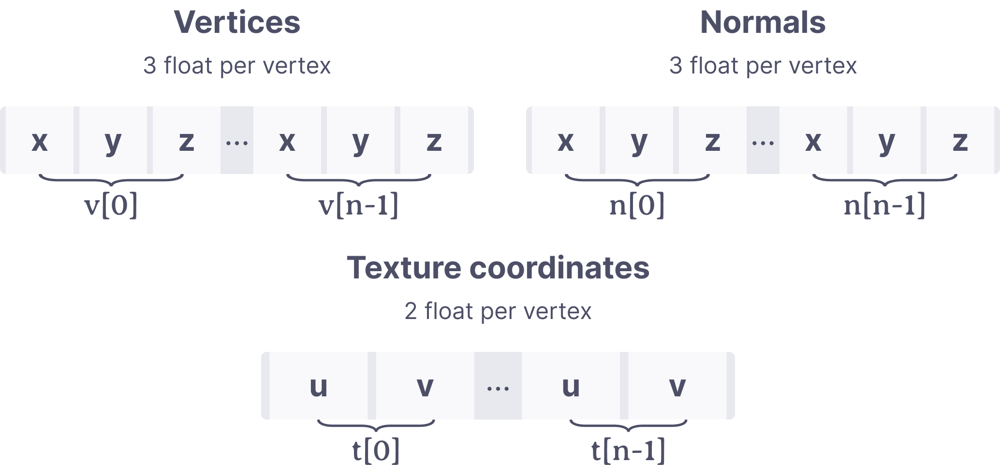

+++
date = '2025-07-05'
draft = false
title = 'SwiftTracer - A physically based rendering engine'
[params]
  math = true
+++

SwiftTracer is a Swift implementation of a physically based rendering engine inspired by PBRT, Mitsuba and many other contributors. It was built to support my research efforts as part of my master's degree.

<!--more-->
But what does "physically based" even mean? For one, we are interested in simulating the behaviour of light such that it respects the laws of physics. Kajiya first introduced the [rendering equation]((https://doi.org/10.1145/15886.15902)) which allows us to do just that by implementing techniques such as Monte-Carlo integration. By accumulating several light paths generated randomly, we obtain an approximation of the light propagation within a scene. This approach can be used to represent complex light effects such as caustics and subsurface scattering.

## Mathematical operations

At it's core, SwiftTracer uses [simd](https://developer.apple.com/documentation/accelerate/simd-library) to perform the mathematical computations: mostly vectors and matrices operations along with some trigonometry. Why does this matter? Because it turns out that ray tracing requires a lot of vector operations, both for image handling and the actual tracing. Imagine you want to sum the contributions of many images to get their average, or say, scale all of their values by a scalar. We would normally make such operations for each pixels. But since simd handles multiple data with a single instruction, it's a perfect fit for this kind of problem. We can store an image as a vector of scalars, and use a single instruction to apply transformation.


## Parellel processing

Rendering a full scene can take a lot of time. To speed up the process, SwiftTracer does the tracing in parallel, thanks to the new `async/await` [concurrency model](https://docs.swift.org/swift-book/documentation/the-swift-programming-language/concurrency/) introduced in Swift 5.5. We split our target image in a series of blocks, which run their own self-contained tracing task. First, we must decide on a block size and make an `assemble` function that will bring them back together as one image.

```swift
func render(scene: Scene) -> PixelBuffer {
    let image = PixelBuffer(
        width: scene.camera.res.x, 
        height: scene.camera.res.y, 
        value: .zero
    )
    let gcd = DispatchGroup()
    gcd.enter()
    Task {
        defer { gcd.leave() }
        let results = await blocks(size: 32, res: scene.camera.res)
        return results.assemble(into: image)
    }
    gcd.wait()
    return image
}
```

Then we create a task for each of the block and start their integration process where the ray tracing happens. Depending on the chosen resolution and block `size`, we will spawn a varying number of rendering processes to run on their own core. The `await` keyword on line 2 tells us to wait the task to be completed before returning, and the one on line 17 to wait for all of the blocks to have finished their rendering.

```swift{lineNos=inline}
func blocks(size: Int, res: Vec2) async -> [Block] {
    return await withTaskGroup(of: Block.self) { group in
        for x in stride(from: 0, to: res.x, by: size) {
            for y in stride(from: 0, to: res.y, by: size) {
                let actual = Vec2(
                    min(res.x - x, size),
                    min(res.y - y, size)
                )
                group.addTask {
                    return integrate(size: actual, p: Vec2(x, y))
                }
            }
        }
        var blocks: [Block] = []
        for await block in group {
            blocks.append(block)
        }
        return blocks
    }
}
```

Finally, we can implement our own integration methods. The most simple version of that is a Monte-Carlo estimation that computes the luminance $L$ with a unidirectional path tracing algorithm. For each pixel $(x, y)$ in the block, we will cast $n$ rays of light and average their total contributions by the number of samples $n$.

```swift
func integrate(size: Vec2, p: Vec2, samples n: Int = 5) -> Block {
    let img = PixelBuffer(
        width: size.x, 
        height: size.y, 
        value: .zero
    )
    var block = Block(position: Vec2(x, y), size: size, image: img)
    for lx in 0 ..< block.size.x {
        for ly in 0 ..< block.size.y {
            let x = lx + block.position.x
            let y = ly + block.position.y
            var avg = Color()
            for _ in (0 ..< n) {
                // Anti aliasing with a uniform noise (0 ... 1)
                let pixel = Vec2(x, y) + rng.next2()
                avg += li(pixel: pixel) // Compute path luminance
            }
            img[lx, ly] = avg / Float(n)
        }
    }
    block.image = img // Assign the resulting image
    return block
}
```

The collision detection is done using a combination of shape intersections, AABBs and even acceleration techniques like BVH. Several image formats like png, jpg, pfm and exr are supported.


## Materials

Whenever light collides with a surface, it will scatter differently based on the physical properties of that surface. For example, diffuse surfaces will reflect the light equally in all possible directions. On the other hand, shiny surfaces like metal or plastic will mainly reflect the light in the direction of a specular lobe. Perfectly specular surfaces will typically have only one possible reflection direction.


SwiftTracer currently implements 4 base materials, which use their own distribution functions to support light scattering. On top of these, it is possible to blend them with a linear combination of two different materials. The strenght of the blend can be defined by an `alpha` parameter.

| Diffuse | Smooth metal | Rough metal | Glass | Blend | 
| :-: | :-: | :-: | :-: | :-: | 
|   |   |   |  |  |

## Geometry

While any numbers of geometry like cylinders, disks, spheres could have been implemented, SwiftTracer supports only a few primitives, with a bigger emphasis on meshes and triangles. For light sources or quick tests, it can be convenient to have simple shapes available, so `Quad` and `Sphere` were also added to that end.

### Mesh

The only mesh format supported at the moment is wavefront (obj). To drive the parsing and loading process, I ported over to [SwiftWavefront](https://github.com/Prismik/SwiftWavefront) the most basic parts of [TinyObj](https://github.com/tinyobjloader/tinyobjloader), a very popular C++ implementation. SwiftWavefront can be consummed as a swift package and offers ready to use meshes with vertices, normals and texture coordinates.



The conversion to triangles can be done by loading the obj and then assigning the data to triangles by using their own transform matrix.

```swift
let obj = Wavefront(filename: filename, encoding: .utf8)
positions = stride(from: 0, through: obj.vertices.count - 1, by: 3).map { i in
    let x = wavefront.vertices[i]
    let y = wavefront.vertices[i + 1]
    let z = wavefront.vertices[i + 2]
    return transform.point(Vec3(x, y, z))
}
```
Triangle intersection uses the [Möller–Trumbore ray-triangle intersection algorithm](https://dl.acm.org/doi/10.1145/1198555.1198746). Vertices and normals are currently supported, but tangents will be added at a later time when I implement microfacets.

## Loading generic objects

The loading of my scenes rely heavily on the `Codable` protocol which has been natively available for a while, as well as a system of generic `Any` boxed types that can be converted to their concrete implementation. You can feed a json to SwiftTracer and it will gracefully do the conversion from the boxed type to the concrete implementations.

To illustrate that process, imagine you have a generic type you want to decode like `Material`. It has several implementations which all require different properties to be decoded. We start with `AnyMaterial`, a box type definition that encapsulates the types it wants to decode and a generic wrapped entity. It also has some high level coding keys shared by all of the `Material` implementations.

```swift
struct AnyMaterial: Decodable {
    enum TypeIdentifier: String, Decodable {
        case diffuse
        case metal
        case dielectric
        case blend
    }
    enum CodingKeys: String, CodingKey {
        case type
        case name
        case params
    }

    let name: String
    let type: TypeIdentifier
    private(set) var wrapped: Material
}
```

Now let's say we have a concrete implementation of that `Material` type called `Diffuse`. It needs an `albedo` property of the `Texture` type. Other materials don't need that property so we define it here.

```swift
final class Diffuse: Material {
    enum CodingKeys: String, CodingKey {
        case albedo
    }

    let texture: Texture
    init(texture: Texture) {
        self.texture = texture
    }
    // ...
}
```

We can now decode that type in `AnyMaterial` and store it in the wrapped property without worrying about it's concrete implementation.

```swift
init(from decoder: Decoder) throws {
    let container = try decoder.container(keyedBy: CodingKeys.self)
    self.type = try container.decode(TypeIdentifier.self, forKey: .type)
    self.name = try container.decodeIfPresent(String.self, forKey: .name) ?? ""

    switch type {
    case .diffuse:
        let params = try container.nestedContainer(keyedBy: Diffuse.CodingKeys.self, forKey: .params)
        let albedo = try params.decodeIfPresent(Texture.self, forKey: .albedo) ?? 0
        self.wrapped = Diffuse(texture: texture)
    }
}
```

Using this is now quite simple; we need a properly formatted JSON with a list of such entities and we're ready to decode it the root decodable container.

```json
{
    "materials": [{
        "name": "red-tint",
        "type": "diffuse",
        "params": { "albedo": [0.95, 0.1, 0.1] }
    }]
}

```

```swift
init(from decoder: Decoder) throws {
    let container = try decoder.container(keyedBy: CodingKeys.self)
    let generic = try container.decode([AnyMaterial].self, forKey: .materials)
    let materials = generic.reduce(into: [String: Material]()) {
        $0[$1.name] = $1.wrapped
    }
}
```